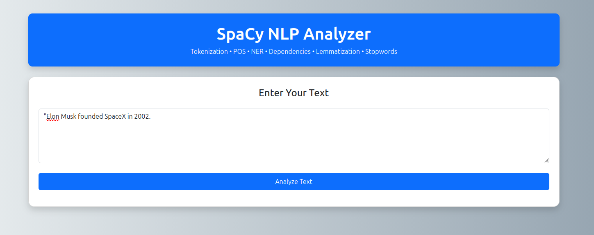
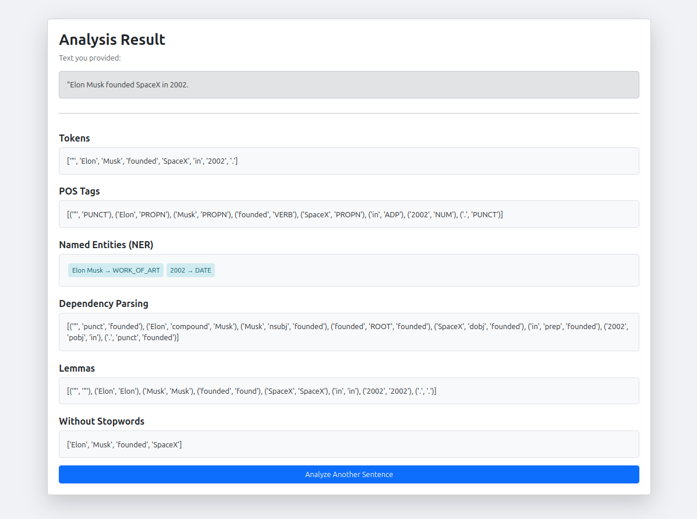
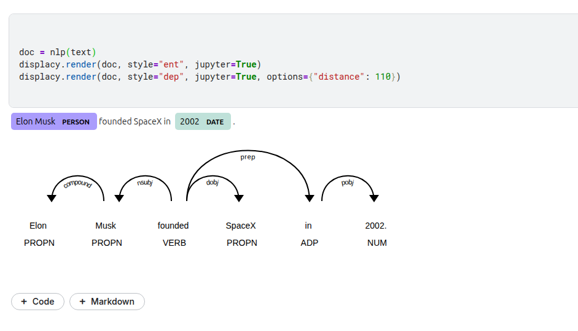

```md
# 🌐 SpaCy NLP Analyzer  
A complete end-to-end NLP learning + deployment project powered by **SpaCy**, **FastAPI**, and **Bootstrap UI**.  
Perfect for beginners learning: Tokenization, POS Tagging, NER, Dependency Parsing, Lemmatization, Stopword Removal.

---

# 🚀 Features

- 🧩 **Tokenization**
- 📝 **POS Tagging**
- 🧠 **Named Entity Recognition (NER)**
- 🔗 **Dependency Parsing**
- 🔄 **Lemmatization**
- 🚫 **Stopword Removal**
- 🌍 **Beautiful Web UI (Bootstrap 5)**
- ⚡ **FastAPI Backend**
- 🎓 **Kaggle Notebook Included**


# 📁 Folder Structure

```

spacy_nlp_analyzer/
│
├── notebooks/
│   └── nlp_experiments.ipynb
│
├── app/
│   ├── app.py
│   ├── processor.py
│   └── **init**.py
│
├── requirements.txt
└── README.md

````


# 🧪 Kaggle Notebook Setup

Run this in Kaggle notebook:

```python
!pip install -U spacy==3.7.2
!python -m spacy download en_core_web_sm
````


# ⚙️ Local Installation (VS Code)

```bash
git clone https://github.com/yourusername/spacy_nlp_analyzer.git
cd spacy_nlp_analyzer
python3 -m venv .venv
source .venv/bin/activate     # Windows: .venv\Scripts\activate
pip install -r requirements.txt
python -m spacy download en_core_web_sm
uvicorn app.app:app --reload
```

NOTE: Sometimes python has problem downloading **en_core_web_sm**  in that case you can manually download it as following..
```bash
pip install https://github.com/explosion/spacy-models/releases/download/en_core_web_sm-3.7.1/en_core_web_sm-3.7.1.tar.gz
```

UI available at:

```
http://127.0.0.1:8000/ui
```

---

# 🖼️ Output Screenshots

### 🔍 Text Input Page



### 🧠 NLP Output Page



### 🧠 Inter Relation Page




---

# 🧩 API Endpoints

### `/analyze` (POST)

```
{
  "text": "Elon Musk founded SpaceX in 2002."
}
```

### `/ui`

Interactive browser UI.

---

# 🛠️ Tech Stack

* Python 3.10+
* SpaCy 3.7.2
* FastAPI 0.115
* Bootstrap 5 UI
* Uvicorn Server

---

# 👨‍💻 Author

Designed & developed by **Vinod Singh**, 2025.

---

# ⭐ If you like this repo, give it a star!

```

---

# 🎉 You're ready to publish this on GitHub!

If you want, I can also generate:

- A **Dockerfile**  
- A **GitHub Actions CI/CD workflow**  
- A **project ZIP**  
- A **logo banner for README**  
- A **dark mode UI theme**  

Just tell me — **what should we add next?**
```

